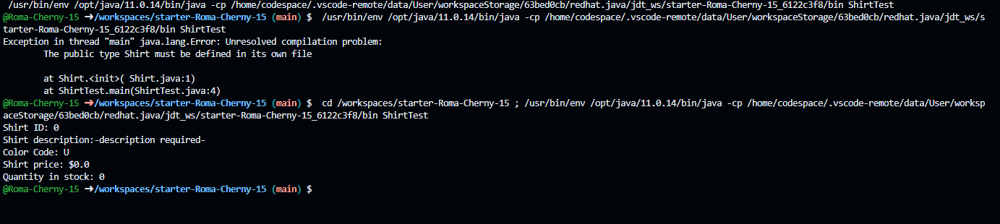
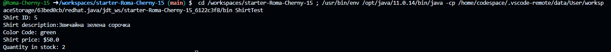

### Завдання 1
#### Запуск без змін
```java
public class Shirt {
  public int shirtID = 0; // стандартне значення номера моделі сорочки
  public String description = "-description required-"; // стандартний опис сорочки
  // коди кольорів: R=червоний, B=синій, G=зелений, U=невідомо
  public char colorCode = 'U';
  public double price = 0.0; // стандартна вартість сорочки
  public int quantityInStock = 0; // стандартна кількість на складі
  
  // цей метод просто виводить всю інформацію про сорочку на екран
  public void displayShirtInformation() {
    System.out.println("Shirt ID: " + shirtID);
    System.out.println("Shirt description:" + description);
    System.out.println("Color Code: " + colorCode);
    System.out.println("Shirt price: $" + price);
    System.out.println("Quantity in stock: " + quantityInStock);
  } // кінець методу displayShirtInformation
} // кінець опису класу
```


#### Змінив властивості сорочки і збереження кольору сорочки у вигляді рядка
```java
public class Shirt {
    public int shirtID = 5; // стандартне значення номера моделі сорочки
    public String description = "Звичайна зелена сорочка"; // стандартний опис сорочки
    // коди кольорів: red=червоний, blue=синій, green=зелений, unset=невідомо
    public String color = "green";
    public double price = 50.0; // стандартна вартість сорочки
    public int quantityInStock = 2; // стандартна кількість на складі

    // цей метод просто виводить всю інформацію про сорочку на екран
    public void displayShirtInformation() {
        System.out.println("Shirt ID: " + shirtID);
        System.out.println("Shirt description:" + description);
        System.out.println("Color Code: " + color);
        System.out.println("Shirt price: $" + price);
        System.out.println("Quantity in stock: " + quantityInStock);
    } // кінець методу displayShirtInformation
} // кінець опису класу
```
