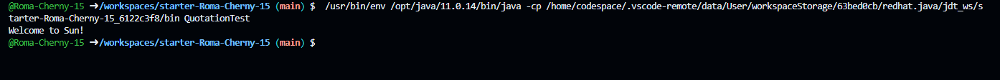
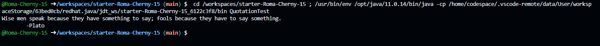

### Завдання 2
#### Запуск без змін
```java
public class Quotation {
  String quote = "Welcome to Sun!";
  public void display() {
    System.out.println(quote);
  }
}
```


#### Змінив цитату і додав автора
```java
public class Quotation {
    String quote = "Wise men speak because they have something to say; fools because they have to say something.";
    public void display() {
      System.out.println(quote + "\n\t" + "Plato");
      
    }
  }
```

